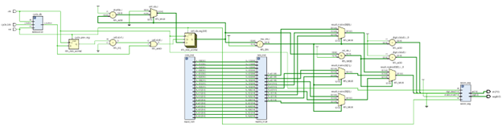
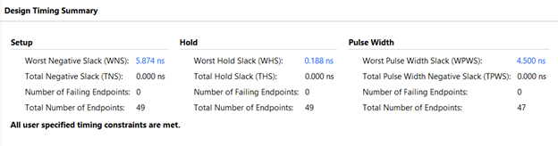
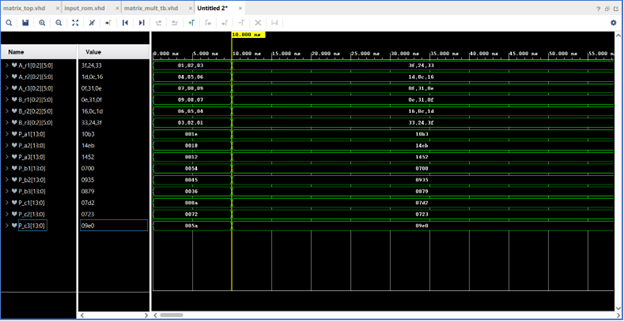

<h1> Custom Matrix Multiplier IP (3x3, 6-bit) </h1>

A 3x3 unsigned matrix multiplier implemented in two variations:

- A pure VHDL build for Digilent NEXYS A7-100T.
- A Zynq-7000 (ZedBoard) hardware/software co-design that wraps the core with an AXI4-Lite interface and communnicates with the embedded system using a bare-metal driver.

<h2> Table of Contents </h2>

- [Repository Layout](#repository-layout)
- [Data Format and Register Map (AXI IP)](#data-format-and-register-map-axi-ip)
- [Boards and Tool Versions](#boards-and-tool-versions)
- [Build and Run: Hardware/Software Co-Design (Zynq)](#build-and-run-hardwaresoftware-co-design-zynq)
- [Build and Run: Pure VHDL (NEXYS A7-100T)](#build-and-run-pure-vhdl-nexys-a7-100t)
- [Design Notes](#design-notes)
- [Results](#results)

## Repository Layout

- `Custom_Matrix_Multiplier/Pure_VHDL/` - Vivado project for the standalone VHDL build targeting NEXYS A7-100T.
- `Custom_Matrix_Multiplier/ip_repo/matrix_multiplier_1_0/` - Custom AXI4-Lite 3x3 multiplier IP.
- `Custom_Matrix_Multiplier/Block_Design/` - Vivado block design with Zynq PS, AXI interconnect, and `matrix_multiplier_1_0`, producing `zynq_design_1_wrapper.xsa`.
- `matrix_multiplier/` - Vitis workspace for the bare-metal test app that writes matrices, triggers the accelerator, and prints results with timing (`src/helloworld.c`).
- `zynq_design_1_wrapper.xsa` - Hardware definition used by Vitis custom component platform.

## Data Format and Register Map (AXI IP)

Each matrix row is packed into one 32-bit register using 8-bit fields (values should stay within 6-bit/0–63 per spec):

- `slv_reg0–slv_reg2`: A rows (`A1`, `A2`, `A3`)
- `slv_reg3–slv_reg5`: B rows (`B1`, `B2`, `B3`)
- `slv_reg6–slv_reg14`: Result rows (`P_a1..P_c3`)

Outputs are zero-extended to 32 bits with the adder carry in the MSB of the stored sum (`matrix_mult.vhd` uses `INPUT_WIDTH=6`, extends products to `SUMW`, then concatenates carry + sum to 32 bits).

## Boards and Tool Versions

- Vivado/Vitis 2025.1 (projects and IP cache were built with this toolchain).
- Pure VHDL target: Digilent NEXYS A7-100T (Artix-7) with seven-segment output in hexadecimal.
- Co-design target: ZedBoard (Zynq-7000 PS + custom AXI4-Lite IP).

## Build and Run: Hardware/Software Co-Design (Zynq)

1. Open `Custom_Matrix_Multiplier/Block_Design/Block_Design.xpr` in Vivado 2025.1. Confirm the Zynq PS + AXI + `matrix_multiplier_1_0` block design, then generate bitstream and export hardware **with bitstream** to refresh `zynq_design_1_wrapper.xsa`.
2. In Vitis 2025.1, create a workspace and import the app from `matrix_multiplier/`. Point the platform to the exported `zynq_design_1_wrapper.xsa` (or reuse the provided copy).
3. Build the `matrix_multiplier` bare-metal application.
4. Program the ZedBoard with the Vivado bitstream, then run the Vitis application on PS7. The app writes sample matrices, measures latency with `XTime_GetTime`, and prints input/output matrices in hex and decimal (`matrix_multiplier/src/helloworld.c`).
5. To test other matrices, edit the `pack()` calls for A and B in `matrix_multiplier/src/helloworld.c`, rebuild, and rerun. Keep per-element values ≤63.

## Build and Run: Pure VHDL (NEXYS A7-100T)

1. Open `Custom_Matrix_Multiplier/Pure_VHDL/Pure_VHDL.xpr` in Vivado 2025.1.
2. Customize matrix inputs under `Custom_Matrix_Multiplier\Pure_VHDL\Pure_VHDL.srcs\sources_1\new\input_rom.vhd`.
3. Synthesize, implement, and generate the bitstream for NEXYS A7-100T. The design drives seven-segment displays with the 3x3 product in hexadecimal.
4. Program the NEXYS A7-100T and verify output against your reference matrices.

## Design Notes

- RTL core (`matrix_mult.vhd`) slices each 32-bit AXI row into three 6-bit elements, multiplies all 9 combinations, and accumulates with two-stage ripple-carry adders per element.
- The AXI wrapper (`matrix_multiplier_slave_lite_v1_0_S00_AXI.vhd`) exposes 15 registers: 6 write-only inputs, 9 read-only results. Results update combinationally as soon as inputs change.
- The C driver uses `XPAR_MATRIX_MULTIPLIER_0_BASEADDR` from `xparameters.h` and accesses the registers directly, while timing is PS-side only because the AXI peripheral is combinational.

## Results

- Block design (Zynq PS + AXI + IP):  
  
- RTL elaboration (VHDL core structure):  
  
- Post-implementation timing summary and waveform:  
    
  
